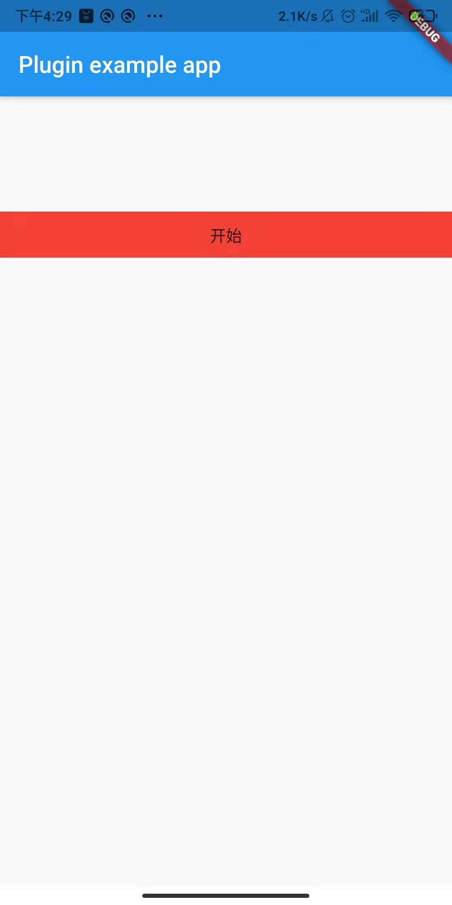

# classroom_screen_recorder

A new flutter plugin project can record screen and save file to disk

>This plugin uses hbrecorder in Android implementation code

## Getting Started

````
import 'package:flutter/material.dart';
import 'dart:async';

import 'package:flutter/services.dart';
import 'package:classroom_screen_recorder/classroom_screen_recorder.dart';

void main() {
  runApp(MyApp());
}

class MyApp extends StatefulWidget {
  @override
  _MyAppState createState() => _MyAppState();
}

class _MyAppState extends State<MyApp> {
  String _platformVersion = 'Unknown';
  bool isRecord = false;

  @override
  void initState() {
    super.initState();
    initPlatformState();
  }

  // Platform messages are asynchronous, so we initialize in an async method.
  Future<void> initPlatformState() async {
    String platformVersion;
    // Platform messages may fail, so we use a try/catch PlatformException.
    try {
      platformVersion = await ClassroomScreenRecorder.platformVersion;
    } on PlatformException {
      platformVersion = 'Failed to get platform version.';
    }

    // If the widget was removed from the tree while the asynchronous platform
    // message was in flight, we want to discard the reply rather than calling
    // setState to update our non-existent appearance.
    if (!mounted) return;

    setState(() {
      _platformVersion = platformVersion;
    });
  }

  @override
  Widget build(BuildContext context) {
    return MaterialApp(
      home: Scaffold(
          appBar: AppBar(
            title: const Text('Plugin example app'),
          ),
          body: Column(
            children: [
              SizedBox(
                height: 100,
              ),
              () {
                if (!this.isRecord) {
                  return GestureDetector(
                    onTap: () async {
                      print("开始录屏");
                      var res = await ClassroomScreenRecorder.startScreenRecord();
                      print(res);
                      if (res["res"] == "success") {
                        this.setState(() {
                          this.isRecord = true;
                        });
                      }
                    },
                    child: Container(
                      height: 40,
                      color: Colors.red,
                      child: Center(
                        child: Text("开始"),
                      ),
                    ),
                  );
                } else {
                  return GestureDetector(
                    onTap: () async {
                      print("stop录屏");
                      var res = await ClassroomScreenRecorder.stopScreenRecord();
                      print(res);
                      if (res["res"] == "success") {
                        this.setState(() {
                          this.isRecord = false;
                        });
                      }
                    },
                    child: Container(
                      height: 40,
                      color: Colors.red,
                      child: Center(
                        child: Text("结束"),
                      ),
                    ),
                  );
                }
              }()
            ],
          )),
    );
  }
}
````
 
 